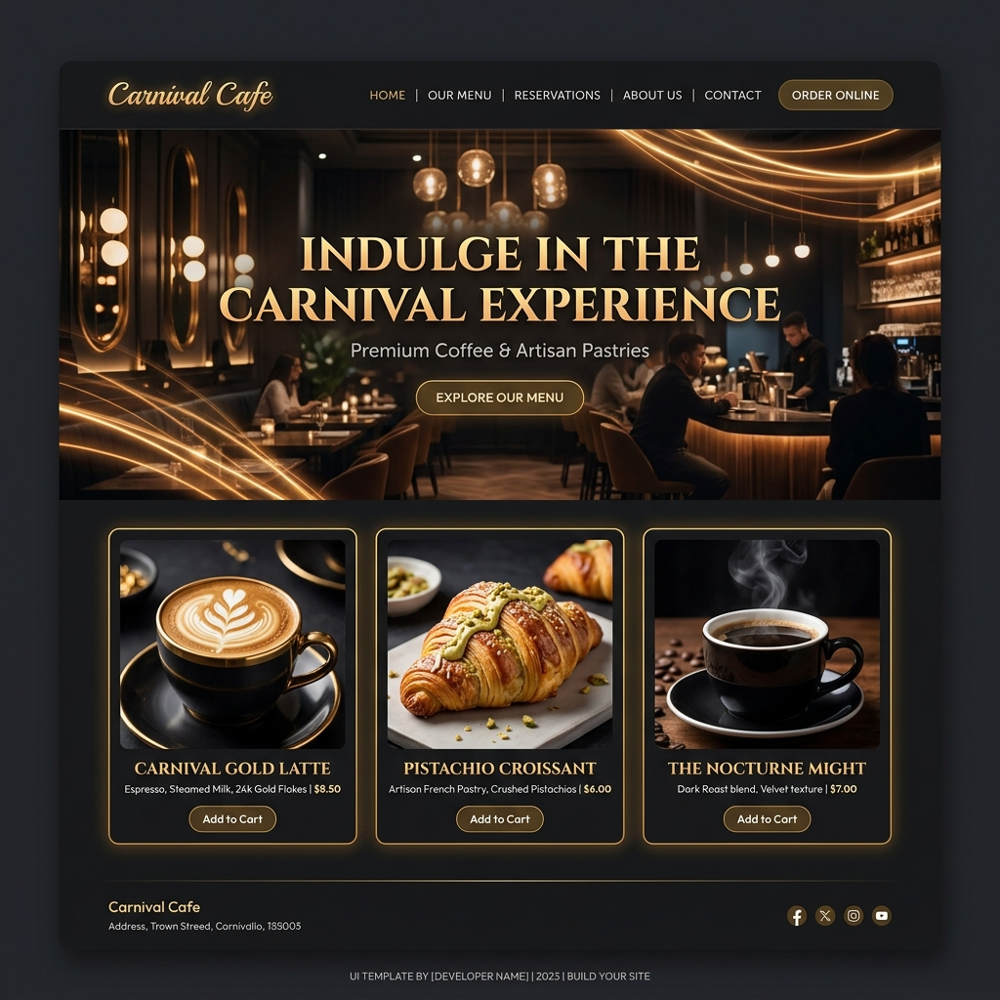

# ☕ Carnival Cafe — Premium Website Template

[](https://react.dev/)
[](https://tailwindcss.com/)
[](https://vitejs.dev/)
[](LICENSE)
[](https://carnival-seven.vercel.app/)

> A premium, fully responsive, single-page cafe and dining template built with React, Tailwind CSS, and custom micro-animations. Replicated to match the sleek aesthetics of state-of-the-art interactive portfolios.

🔗 **Live Demo**: [carnival-seven.vercel.app](https://carnival-seven.vercel.app/)



Carnival Cafe is a luxury template designed to highlight signature coffee, artisanal pastries, and curated small plates. It features a custom design system centered on warm accents, elegant typography, and engaging micro-interactions.

---

## ✨ Features

- **🌙 Premium Aesthetics**: Elegant dark mode theme (`bg-espresso-dark`) combined with luxurious gold gradients, grain overlay texturing, and glassmorphic panels.
- **✨ Micro-Animations**: Ambient floating orbs, scroll-linked fade-in-up effects via a custom intersection observer hook (`useReveal`), and responsive hover effects.
- **🍽️ Interactive Menu Grid**: Visually stunning card layouts displaying categories, prices, chef picks, and bestsellers with dynamic hover states.
- **📅 Fully-featured Sections**: Includes `Hero` landing, `Our Story`, `Why Us` features, `Menu Highlights`, dynamic `Testimonials` carousel, and a custom `Contact & Booking Form`.
- **📍 Integrated Dark Map**: Embedded Google map styled with a custom grayscale filter to match the site's dark aesthetic.
- **🛠️ Developer-First Customization**: Modular components, a clean design system, and central assets making modifications fast and intuitive.

---

## 🚀 Quick Start

### Prerequisites
Make sure you have [Node.js](https://nodejs.org/) installed (v18.x or higher recommended).

### 1. Clone & Install
```bash
# Clone the repository
git clone https://github.com/bhargavgurugubelli/carnival.git

# Navigate to directory
cd carnival

# Install dependencies
npm install
```

### 2. Local Development
Start the Vite development server:
```bash
npm run dev
```
Open your browser and navigate to `http://localhost:5173`.

### 3. Production Build
Compile the site into highly optimized static assets:
```bash
npm run build
```

---

## 🎨 Customization Playbook

The site is designed to be easily forkable and fully customizable to suit any coffee shop, dining, or small business project. Follow this guide to adapt the website for your needs:

### 1. Branding & Colors
All key colors are controlled via Tailwind CSS config. Open [tailwind.config.js](tailwind.config.js) to customize the color palette:
```javascript
colors: {
  gold: { 
    light: '#F5E6C8', 
    DEFAULT: '#C9A84C', // Primary accent color
    dark: '#9B7D2E' 
  },
  espresso: {
    light: '#3D2B1F',   // Secondary dark background
    DEFAULT: '#1E1108',
    dark: '#0D0804',    // Core background color
  },
  cream: '#F8F1E4',     // Text color
  warm: '#D4B896',      // Secondary text/accent
}
```

### 2. Typography
Fonts are configured in [tailwind.config.js](tailwind.config.js) and imported in [index.html](index.html).
- **Display font**: `Playfair Display` (used for large headers and titles)
- **Body font**: `Cormorant Garamond` (used for secondary descriptions and italic texts)
- **Sans font**: `Jost` (used for navigation links, tags, and buttons)

To swap them, add your Google Font link in [index.html](index.html#L7-L9) and change the font mappings under `fontFamily` in your Tailwind configuration.

### 3. Modifying the Menu
The cafe menu highlights are fully data-driven. Open [src/components/Menu.jsx](src/components/Menu.jsx) and edit the `menuItems` array to customize your offerings:
```javascript
const menuItems = [
  {
    id: 1,
    name: 'Velvet Black Espresso',
    category: 'Signature Coffee',
    description: 'Triple-shot single-origin espresso with notes of dark chocolate and toasted hazelnut.',
    price: '₹380',
    image: 'https://images.unsplash.com/...',
    tag: 'Bestseller', // Options: 'Bestseller', 'New', 'Chef\'s Pick', 'Premium', etc.
  },
  // Add or remove items here...
]
```

### 4. Updating Operating Hours & Location
To update contact information, phone, email, hours of operation, and the Google maps embed, edit [src/components/Contact.jsx](src/components/Contact.jsx):
- Update `contactDetails` array with your address and email.
- Change the URL source inside the `<iframe>` component to point to your Google Map location. The sepia/grayscale filters are automatically applied in CSS to preserve the theme styling!

### 5. Updating Testimonials
Customer reviews can be customized in [src/components/Testimonials.jsx](src/components/Testimonials.jsx) by editing the testimonials list.

---

## 🤝 Contributing

Contributions are welcome! If you want to improve animations, fix a bug, or add new components (like a booking scheduler or full-page menu):
1. **Fork** the repository.
2. Read the [CONTRIBUTING.md](CONTRIBUTING.md) guide.
3. Create your feature branch (`git checkout -b feature/NewFeature`).
4. Commit your changes (`git commit -m 'Add some NewFeature'`).
5. Push to the branch (`git push origin feature/NewFeature`).
6. Open a **Pull Request**.

---

## 📄 License

This project is licensed under the MIT License - see the [LICENSE](LICENSE) file for details.
